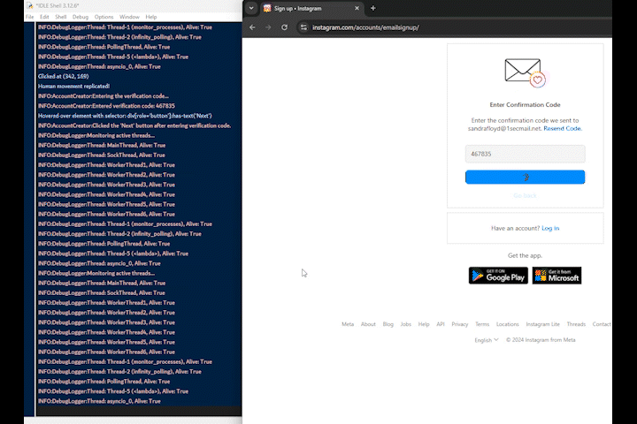
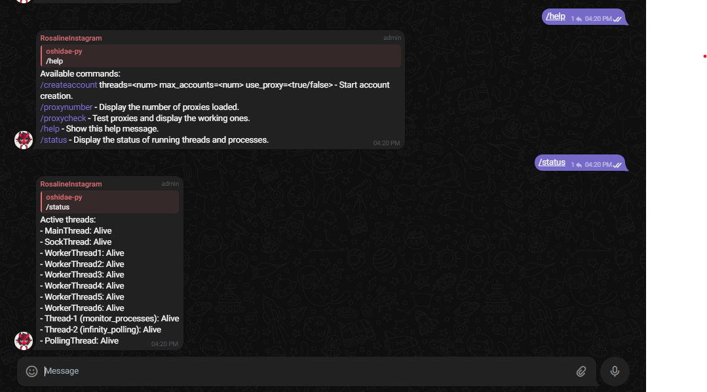
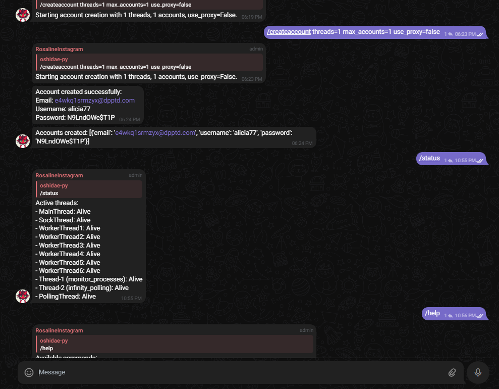
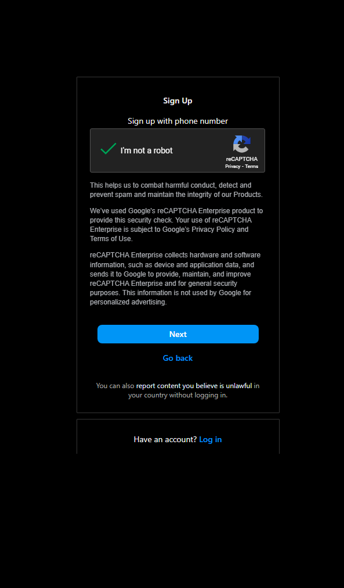
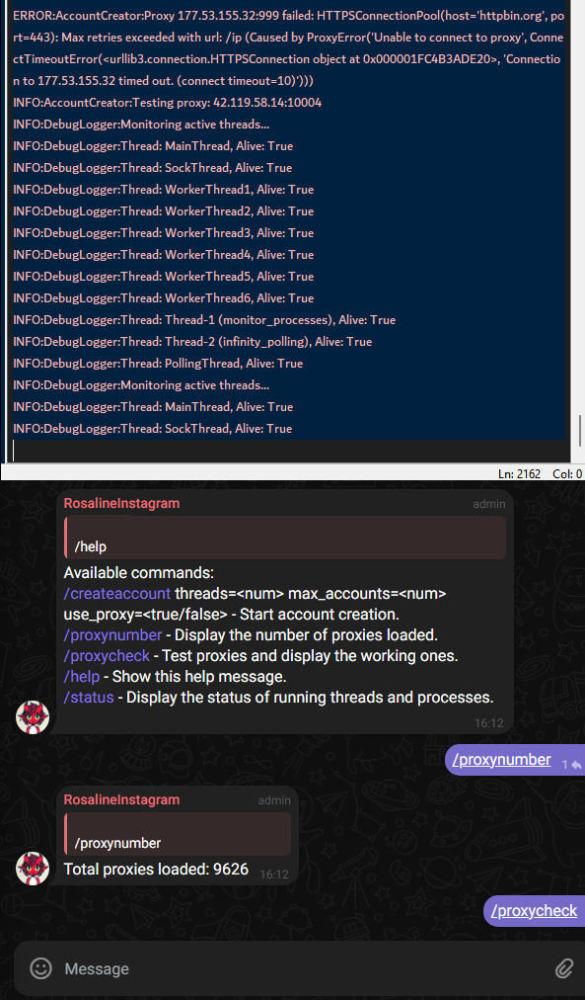
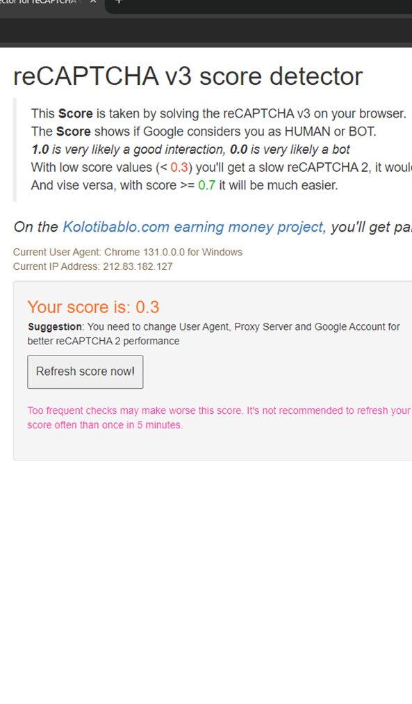

<p align="center">
  
</p>
<h1 align="center">
  <span style="color: red; text-shadow: 1px 1px 2px black, 0 0 1em white;"> 🔥Multithread0r </span>Instagram🔥
</h1>

<div style="display: flex; justify-content: space-evenly; align-items: center;">
  <div>
    <p align="center">
    
    <p align="center">
      Email Generation/Parsing/Automation
    </p>   </div>
  <div>
    <p align="center">
    
    <p align="center">
      Graceful Human-Like Interaction
    </p>  
    </div>
  <div>
    <p align="center">
    
    <p align="center">
      Confirmed Working 2024
    </p>
   </div>
</div>

---
<p align="center">🚨 WARNING: FOR EDUCATION PURPOSES ONLY! NOT INTENDED FOR ILLEGAL PURPOSES! 🚨

<p align="center"> THIS IS NOT A FULL VERSION - @oshidaepy Telegram

---
## Table of Contents

1. [Features Demonstration](#features-demonstration)
2. [Program Capabilities](#program-capabilities)
3. [Requirements](#requirements)
4. [Key Code Snippet](#key-code-snippet)
5. [Screenshots & Demo](#screenshots--demo)
6. [Credits](#credits)
---

## 🚀 Features
### Account Management, Commands, Captcha Bypass:
<div style="display: grid; grid-template-columns: repeat(3, 1fr); gap: 10px;">
  
  
  
</div>


---

## 🪜 Program Capabilities

-   **Full Name**: Randomized using the `Faker` library.
-   **Email Address**: Generated dynamically using a temp-mail API like `SecMail` or `1SecMail`.
-   **Username**: Smartly combines email prefixes with unique identifiers to create plausible usernames.
-   **Password**: Randomized and strong passwords generated with the `Faker` library.
-   Automates the Instagram signup process with human-like interactions to evade detection.
---
- -   **Stealth Mode Integration**:
    -   Removes `navigator.webdriver` properties.
    -   Masks browser automation fingerprints.
    -   Spoofs `navigator.plugins`, `navigator.languages`, and other common indicators.
-   **Viewport Randomization**:
    -   Randomizes browser viewport dimensions to simulate real-world browsing.
-   **Mouse Movements**:
    -   Implements randomized, human-like mouse movements and clicks.
-   **Scroll Simulation**:
    -   Simulates random scrolling to mimic human activity.
 ---
 Uses **Playwright** with the following enhancements:

-   **Stealth Mode Integration**:
    -   Removes `navigator.webdriver` properties.
    -   Masks browser automation fingerprints.
    -   Spoofs `navigator.plugins`, `navigator.languages`, and other common indicators.
-   **Viewport Randomization**:
    -   Randomizes browser viewport dimensions to simulate real-world browsing.
-   **Mouse Movements**:
    -   Implements randomized, human-like mouse movements and clicks.
-   **Scroll Simulation**:
    -   Simulates random scrolling to mimic human activity.
 ---
 Dynamically rotates **browser fingerprints** using BrowserForge:

-   Generates unique headers, user agents, and device properties for each session.
-   Mimics realistic screen resolutions, color depths, and pixel ratios.
-   Customizes headers such as `sec-ch-ua`, `User-Agent`, `Accept-Language`, and more.
-   Randomizes WebRTC, WebGL, and navigator data for anti-fingerprinting purposes.
-   Spoofs hardware and software properties, including GPU, audio codecs, and fonts.
---
 -   Seamlessly integrates with SmartProxy or other proxy providers:
    -   Rotates proxies to ensure anonymity and avoid IP-based detection.
    -   Supports HTTP, HTTPS, and SOCKS5 proxies.
    -   Detects and filters out flagged or non-working proxies.
-   Implements per-session proxy allocation for unique IP addresses during account creation.
-   Allows enabling/disabling proxy usage via command-line arguments or Telegram commands.
---
Solves Google reCAPTCHA v2 with the following techniques:

-   **Audio Processing**:
    -   Uses a reCAPTCHA-solving API to bypass CAPTCHA challenges.
-   **Custom Token Injection**:
    -   Injects pre-solved CAPTCHA tokens into the Instagram signup form.
-   Logs CAPTCHA-solving events for transparency and debugging.
---
-   Supports temp-mail APIs (e.g., `SecMail`) to handle email verification:
    -   Fetches inbox messages in real-time.
    -   Extracts and submits verification codes automatically.
    -   Implements retry logic with timeout for robust email handling.
-   Fully automates email validation for the Instagram signup process.
---
Provides a user-friendly interface via Telegram commands:

-   **Account Creation**:
    -   `/createaccount threads=<num> max_accounts=<num> use_proxy=<true/false>` to initiate account creation.
-   **Proxy Management**:
    -   `/proxynumber`: Displays the number of loaded proxies.
    -   `/proxycheck`: Tests and verifies working proxies.
-   **Status Monitoring**:
    -   `/status`: Lists active threads and processes.
-   **Help Menu**:
    -   `/help`: Displays all available commands with usage instructions.
-   Sends real-time updates on account creation progress and proxy status.
---
Supports concurrent account creation using multiple threads:

-   Divides workload across threads for faster processing.
-   Handles thread-safe operations with robust error handling.
---
Implements numerous techniques to evade Instagram’s bot detection:

-   Random delays between actions to simulate human behavior.
-   Human-like interactions such as hovering, scrolling, and typing speed variation.
-   Avoids triggering anti-bot mechanisms by carefully throttling requests.
---
-   Extensive logging for debugging purposes:
    -   Logs every step of the account creation process.
    -   Captures detailed error messages for failed operations.
-   Takes screenshots of browser windows during critical failure points for debugging.
-   Automatically retries failed steps, such as email verification or form submission.
---
-   Allows users to customize account creation parameters:
    -   Number of accounts to create.
    -   Thread count for parallel processing.
    -   Proxy usage toggle (enabled/disabled via command).
-   Enables developers to inject custom headers, fingerprints, or behaviors.
---

## 🛠️ Requirements

### Prerequisites

To run this program, ensure you have the following installed and configured on your system:

1.  **Python**: Version 3.8 or later ([Download Python](https://www.python.org/downloads/)).
    
2.  **FFmpeg**: Required for audio conversion (used in CAPTCHA solving).  
    [Download FFmpeg](https://ffmpeg.org/download.html) and ensure it's added to your system's PATH.
    
3.  **Google Chrome**: Install the latest version of Chrome (Download Chrome).
    
4.  **ChromeDriver**: The driver version must match your Chrome version.  
    [Download ChromeDriver](https://chromedriver.chromium.org/downloads).
    

----------

### Installing Dependencies
- To install the required Python libraries, ensure `pip` is installed and run the following commands:

#### 1. Install core dependencies:
`pip install -r requirements.txt` 
#### 2. Install additional libraries (if not in `requirements.txt`):
-   **Playwright for browser automation**:
    `pip install playwright rebrowser-playwright`   
    _Run `playwright install` after installation to download browser binaries._
-   **BrowserForge for fingerprinting**:
    `pip install browserforge[all]
    python -m browserforge update`     
-   **Faker for generating fake user data**:
    `pip install faker`     
-   **HTTP Requests for API communication**:
    `pip install httpx requests` 
-   **Telegram Bot API for integration**:
    `pip install pyTelegramBotAPI`  
-   **reCAPTCHA Solvers**:
    `pip install speechrecognition pydub`  
-   **Debugging Tools**:
    `pip install flask` 

----------

### Environment Variables

Ensure the following are properly configured for your environment:

-   **FFmpeg Path**: Add FFmpeg to your system's PATH variable.
-   **Environment Variables for Enhanced Stealth** (optional):
    
    bash
    
    Copy code
    
    `export REBROWSER_PATCHES_RUNTIME_FIX_MODE=addBinding
    export REBROWSER_PATCHES_SOURCE_URL=app.js
    export REBROWSER_PATCHES_UTILITY_WORLD_NAME=customUtilityWorld` 
    

By following the steps above, you'll ensure the program runs smoothly without dependency issues. Let me know if you'd like further adjustments!

---

## 📝 Key Code Snippet
Here is an example of how you can add custom bot features using the `interaction_manager.py`:

```python
from interaction_manager import follow_user

# Example of following a user
account = {"username": "demo_user", "session_token": "demo_token"}
user_id = "123456789"
follow_user(account, user_id)
```

---

## 📷 Screenshots & Demo
### Program in action:
<div style="display: grid; grid-template-columns: repeat(3, 1fr); gap: 10px;">
  
  
  
</div>

---

## ⭐ Credits
- [playwright-stealth](https://github.com/AtuboDad/playwright_stealth)
- [browserforge](https://github.com/daijro/browserforge)
- [playwright-recaptcha-solver](https://github.com/xrip/playwright-recaptcha-solver)
- [tele-bot-api](https://github.com/python-telegram-bot/python-telegram-bot)
---

**For the full version of this program, contact @oshidaepy*

